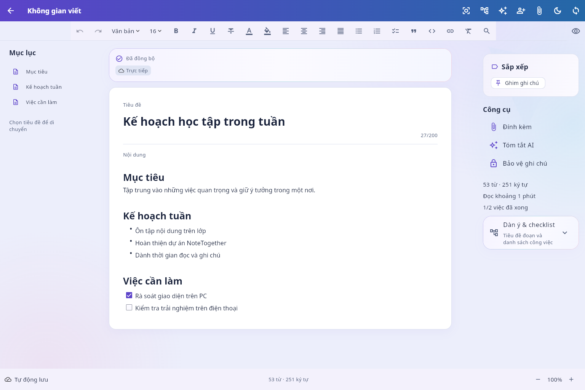
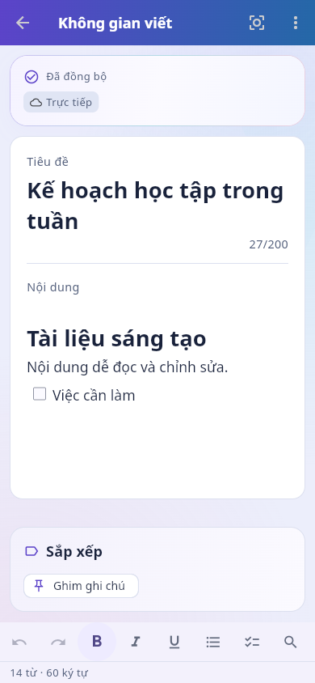
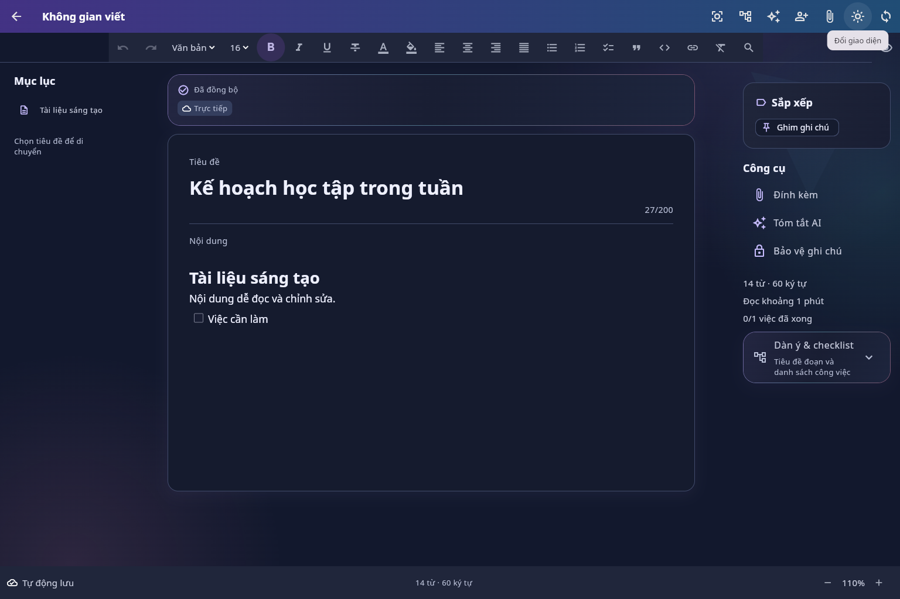
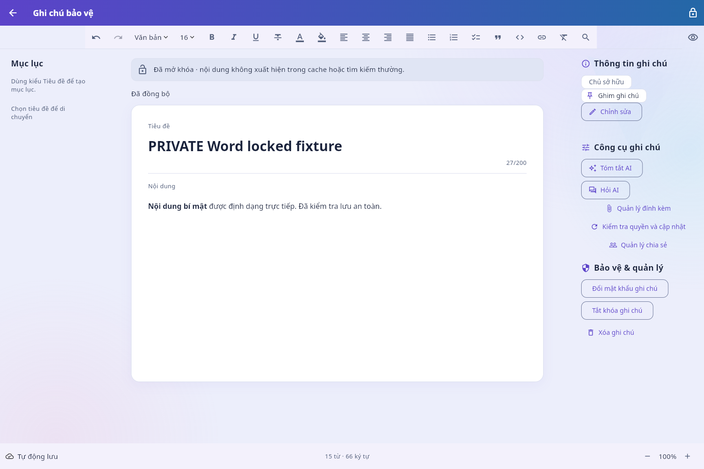

# Editor PC/phone trực tiếp —09/10/2026

Source: base717f0ab6b04b6f63ad7f921a82b91cd2f4b41319 + working changes trên
codex/ui-ux-performance. Chưa có commit mới/push; source SHA256 ở manifest.json.
Đợt theme cohesion trước đó vẫn giữ snapshot riêng.

| Kiểm tra | Kết quả | Bằng chứng |
| --- | --- | --- |
| Format95files, analyze | PASS,0changes/noissues | final-verification.json, analyze.txt |
| Full Flutter tests trên code cuối | PASS210 | flutter-tests.txt |
| Backend gồm rich document/AI/roles/invalid attrs | PASS108 | local-gates-before-shortcut.txt; backend source không đổi sau gate này |
| Web release local/API8023 + offline40static | PASS | web-qa-build.txt, manifest.json |
| APK debug/API8000 compile | PASS | apk-debug-build.txt, manifest.json |
| Chrome154/Playwright,8luồng/5viewport | PASS,0errors/0warnings | qa.json, browser-qa.txt,14PNG |
| HTTP owner/editor/viewer/stranger | PASS, included browser QA and backend | viewer403, editor200, stranger404; owner roundtrip |
| Native runtime/FPS/IME/TalkBack/Gemini thật/release | NOT RUN | Không dùng benchmark cũ cho code mới |

Browser plugin absent: dùng Playwright bundled và Chrome thật headless. QA backend/DB
riêng, email worker tắt, AI fixture-not-an-llm; không gọi provider/cloud. Password chỉ
là fixture@example.test; không xuất JWT/keys/cookies/private database vào evidence.
Grant của ghi chú bảo vệ được GET kiểm tra bằng đúng session đã mở khóa.

QA thao tác keyboard Select All/thay nội dung và toolbar bold; h2/mục lục; Ctrl F mở
tìm-thay thế; reload vẫn giữ định dạng; read/zoom/theme/focus và5 viewport; plain search;
HTTP ACL; protected unlock/edit/save/relock. Caret/controller/frozen revision/encrypted
recovery/offline/outbox races có regression tests; không suy ra screen reader/IME từ tests.

Các retry ban đầu phát hiện vấn đề focus accessibility và Select All xóa newline của
Quill làm trống vùng viết. Đã sửa trước mutation, thêm regression render/format/undo/
limits và rerun local/browser. Một số retry là locator thay đổi accessible name hoặc
grant của session đăng ký khác session UI; final QA dùng đúng controls/session. Raw
retry logs ngoài repo. Backend có1 warning upstream Starlette/httpx; build có warning
font Cupertino/Java SDK, không ngăn compile. Không nhận định60FPS hay production-ready.

## Ảnh thực tế

Sau relock: protected-relocked.png; không còn title/body/labels/metadata riêng tư.
Ảnh tablet/landscape/1000px/read/focus/reload có trong thư mục. Concept desktop/mobile
chỉ là tham chiếu thiết kế; implementation bằng Flutter widgets. Ledger đối chiếu:
[ADAPTIVE_DOCUMENT_EDITOR](../../docs/ADAPTIVE_DOCUMENT_EDITOR.md).

qa.cjs chạy lại với server7361/API8023; qa-fixture.py cần đặt ROOT theo checkout, DB
ở bên ngoài repository như lệnh nghiệm thu. Không bật SMTP/LLM khi chạy fixture.
Sau QA, build Web local được khôi phục API8000 cho scripts/start_web.ps1; default-web-build.txt
và default-web.json ghi binary đó. Hai dịch vụ QA do task tạo đã được dừng sau nghiệm thu
(cleanup.json). final-verification.json xác nhận192 source hashes khớp manifest và README/Readme đồng bộ.
