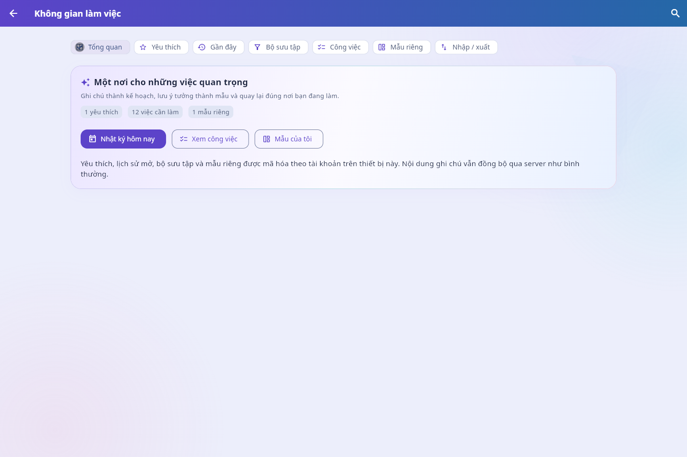
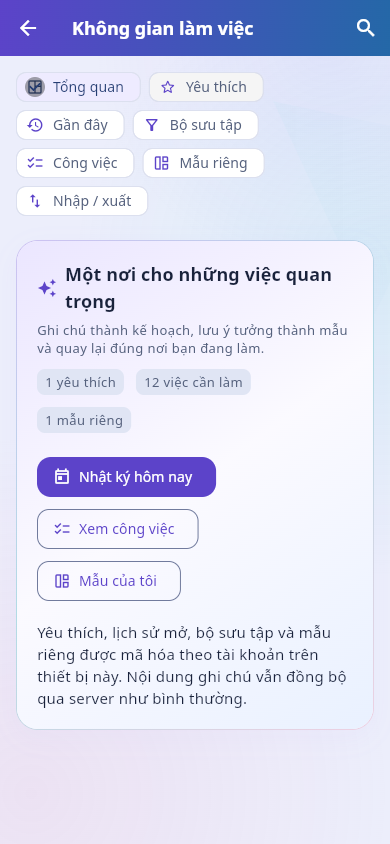

# Workspace sáng tạo — nghiệm thu 10/10/2026

Base `a5e5ec60568b7ee2b0c50290a3e6502a4d490110`, working changes trên
`codex/adaptive-word-editor`. Source manifest có SHA256 theo từng file; chưa commit/push.
Giữ nguyên evidence/audit ordering và các phiên bản trước. Đây là tính năng bổ sung ngoài
32 tiêu chí theo yêu cầu người dùng, không tự chấm điểm sáng tạo hoặc claim submission-ready.

## Kết quả

| Target / lệnh | Kết quả và phạm vi |
|---|---|
| Dart format lib/test/integration_test/test_driver | PASS99files0changes — format-final.txt |
| Flutter analyze | PASS không issue — analyze-final.txt |
| Flutter test --reporter expanded | PASS234 — flutter-final.txt; 19 workspace tests mới |
| scripts/check.ps1 | PASS233 Flutter/109 backend trước sửa app bar/palette; backend không thay sau gate này — check.txt |
| scripts/build.ps1 -Target web -ApiUrl http://127.0.0.1:8033 | PASS local release compile + static-only worker40resources — web-qa-final.txt |
| flutter build apk --debug --dart-define=API_URL=http://10.0.2.2:8000 | PASS compile đúng source cuối — apk-debug-final.txt; không native runtime claim |
| HTTP backend loopback8033 | Owner/editor đúng revision200, stale owner409, viewer403, stranger404, locked423, revoked listing empty, six-field projection — http-roles.json |
| Chrome loopback7363 + FastAPI8033 | PASS các luồng mô tả bên dưới; không dùng mock note endpoint/LLM |

Backend cảnh báo deprecation từ dependency httpx/Starlette pinned; builds có thông báo
Wasm dry run/font tree-shaking và Android SDK XML tùy toolchain. Không hạ pin/quality gates.
Flutter kiểm tra lại toàn suite sau các sửa UI cuối; không lặp backend khi backend source không đổi.

## Luồng Chrome thật

1. Đăng nhập account QA, Ctrl+K mở palette; ghi chú khóa bị loại. Lưu hai favorites.
2. Checklist chuyển Cần làm → Hoàn thành bằng UI; HTTP GET xác nhận marker x được lưu.
3. Tạo bộ sưu tập từ khóa, chọn và mở đúng kết quả. Bộ sưu tập còn sau offline reload.
4. Tạo/sửa mẫu riêng, dùng mẫu mở fresh durable draft, Ctrl+S lưu note vào server.
5. Tạo hai nhật ký cùng ngày10/10/2026; server xác nhận hai UUID khác nhau.
6. Chọn hai owner notes, download Blob thật, lưu exported.notetogether.json; không ID/role/
   permission metadata. Upload lại đúng file, preview2notes rồi xác nhận khi network offline.
7. Offline reload mở lại app:9notes và2 immutable changes chờ; favorites/view/template còn.
   Nối mạng: server7→9notes, đúng2UUID mới, revision1/owner, nội dung trùng từng byte trong
   file xuất; không thêm bản trùng ở refresh sau. Xem roundtrip.json/export SHA256.
8. Mở hai notes từ workspace, Gần đây đúng thứ tự mở. Từ phiên owner khác khóa note đang
   có trong favorites/recent và đang chọn trong export dialog: title biến mất sau SSE, export
   abort với thông báo quyền thay đổi; Recent chỉ còn note khả dụng. remote-lock.json/YAML.
9. Đổi theme bằng UI editor rồi trở lại workspace; desktop/mobile dùng theme chung và layout
   wrap/slivers. Widget QA bổ sung320px/chữ200%, keyboard250px portrait/landscape,
   1000label picker lazy và20.000task rows chỉ dựng phần visible.

Các thử nghiệm file dùng tài khoản/nội dung QA, không token/cookies/header auth trong evidence.
Fixture mail/LLM bị tắt. File export chỉ chứa nội dung QA được chủ động chọn, không dữ liệu người dùng.
Console online không phát hiện lỗi UI. `console-offline.txt` ghi ERR_INTERNET_DISCONNECTED
ở /me và /events do chủ động tắt mạng; không gọi toàn phiên offline là zero-console-errors.

## Ảnh và sửa trong QA

Ảnh `before-appbar-fix/01…10` lưu luồng functional/transfer/privacy trước sửa màu app bar.
Kiểm tra ảnh phát hiện chữ trắng trên app bar thiếu nền; source cuối dùng noteAppBar gradient
chung. Palette cuối cuộn cả header/form/results/footer để không tràn khi bàn phím mở.
Ảnh `11…` ở thư mục gốc phản ánh source cuối, gồm desktop/light, dark và viewport mobile.

Test suite trước đó cũng phát hiện sidebar1280×800 tràn khi thêm item; sửa thành scrollable,
bỏ intrinsic layout. Export dialog320px/200% được đổi sang sliver scroll. Cập nhật test helper
để reveal và pump layout trước tap, giữ nguyên assertion privacy/recovery/filter/hidden Home.

## Chạy lại có dữ liệu tách biệt

Copy qa_server.py/fixture.py sang `output/workspace-qa` (ignored), không chạy với database
của người dùng. Đặt PYTHONPATH tới repo, chạy uvicorn qa_server:app --app-dir output/workspace-qa
ở loopback8033; email/LLM tắt. Build Web API8033, serve build/web ở7363. Playwright CLI:
open --browser chrome, bật flt-semantics-placeholder sau bootstrap; snapshot trước dùng refs.
Các JS trong thư mục là UI QA steps, không test giả lập backend hay production navigation.
fixture.py tạo4account@example.test và kiểm tra ACL; scripts chỉ phục vụ DB thử của phiên này.

Sau QA, build lại Web API mặc định8000 và đóng đúng các process/session QA đã tạo. Không
public deploy, không merge/bypass ruleset và không thay author/contribution history.

## NOT RUN

Native runtime cho workspace mới, Android picker/SAF/keyboard/IME với tính năng mới, NVDA/
TalkBack thực, FPS/GPU/peak RAM mới, multi-tab/multi-device workspace sync, public HTTPS/
signing/release, Gemini/SMTP thật, video/report/4weeks/teamwork. Không dùng compile/widget/
local HTTP để đóng các gates này. Personal workspace hiện chỉ mã hóa trên thiết bị theo account.

## Xem nhanh ảnh source cuối

[PC light](11-overview-final-desktop.png) · [Bảng công việc PC](12-tasks-final-desktop.png) ·
[Favorites sau lock](13-favorites-after-lock.png) · [PC dark](14-overview-final-dark.png) ·
[Mobile dark](15-overview-mobile-dark.png) · [Tasks mobile](16-tasks-mobile-dark.png) ·
[Palette mobile](17-palette-mobile-dark.png) · [Mobile light](18-overview-mobile-light.png) ·
[Landscape](19-overview-landscape.png) · [Tablet](20-overview-tablet.png) ·
[Bộ sưu tập sau import](21-collection-final.png) · [Mẫu riêng](22-templates-final.png).

Ảnh sau khi chờ route/theme transition700ms kết thúc; không dùng screenshot giữa fade.
Console current-page summary được ghi ở console-online-summary.txt; console-all-pages.txt
là raw log cả phiên, có các HTTP errors offline đã mô tả ở trên.

